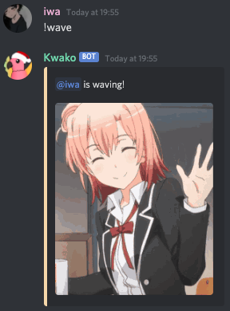

# Actions commands

To add more interactivity between members, some actions commands are available.  
You can find out the entire list of these commands by doing `!help`.

### Actions towards people

Commands like `!hug` or `!pat` requires you to mention the people you want to be the target of your command.

__Example:__ `!hug @iwa` 

?> **Note:** You can mention up to 5 people per command. The limit is put to 5 in order to avoid mass mentioning.

### Self-actions

You can do some commands which describes your own actions, like `!cry` or `!wave`. You don't need to mention anyone by doing these.

__Example:__ `!wave` 
