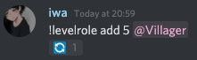
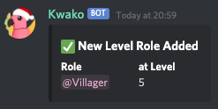
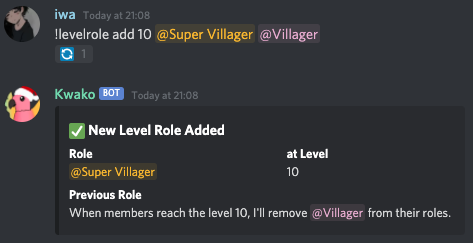
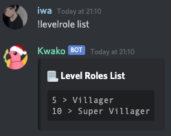
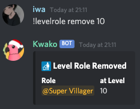

# Level System

Kwako has an integrated level system, relfecting how members are invested into the server by giving them experience points the more they talk. 
By default, this system is **on**, but could be disabled in `!config`.

### Checking your level

You can see your level by doing `!profile`.  
Kwako will send you your profile card.

You can also check someone's level by mentionning them in the command: `!profile @user`

### Level Leaderboard

By doing `!leaderboard exp`, you can show the top 10 people with the most levels in your server.

### Level Rewards

You can rewards your members for their implication by giving them a role when they achieve a certain level.

#### Add a LevelRole

To add a role reward, do the following command:

`!levelrole add (level number) (mention role) [mention previous role]` 
**Example:** 

You'll then see a 🔄 reaction from Kwako: that means Kwako is currently giving the role to whoever already achieved the required level. 
When the process is done, you'll receive this confirmation message from Kwako: 

You can also add a "previous role", which will be took off from the member while giving them the new role when they achieved the required level. 
**Example:** 

?> **Note:** The maximum level is 50 and is **not** editable.

#### List of all LevelRoles

You can see every LevelRoles you created by doing: `!levelrole list`.

**Example:** 

#### Delete a LevelRole

You can delete a LevelRole by doing the following command: `!levelrole remove (level number)`.

**Example:** 

!> Doing the command will **NOT** remove the role to all the members. You'll have to manually do it.