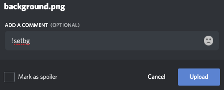

# Profile Card

Your profile card contains some useful information about you and the server you're in.
The current profile card shows:

- Your level and progress
- Your birthday
- Your Switch Friend Code
- A customizable background

### Show your profile card

To see your profile card, you only need to do `!profile`. 

### Register your birthday

To register your birthday, use the following command: 
`!setbirthday dd/mm`

Please use the **dd/mm** date foramt, without the year.

### Register your Switch FC

To register your Switch Friend Code, use the following command: 
`!setfc 1234-1234-1234`

Please enter your FC without the 'SW-' at the beginning.

### Customize your Profile Card background

You have 2 ways to do so:
- Use a URL: `!setbg (url)`
- Send your file directly through Discord, like so: 

To remove your custom background, simply do: `!setbg off`.