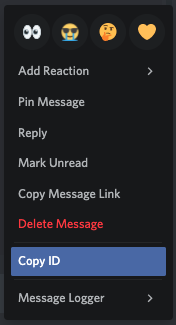

# How to fetch a Discord UID

Every thing on Discord has a unique ID: users, channels, servers, roles, etc... 
By default, it is not possible to fetch those ID. You'll need to enable the Developer Mode on your Discord.

## Enabling the Developer Mode

There are multiple ways to enable it, depending on the platform you're on.

#### PC

Go to your Discord settings > Appearance > Developer Mode.

#### iOS

Go to your profile page > Appearance > Developer Mode.

#### Android

???

## Fetch the ID

Now that you have enabled the Delevoper Mode, you're able to fetch those UID. 
To do so, right click / long press on something (a Message, a User or a Channel): you should now see the "Copy ID" button. Click on it. You can now paste the ID anywhere.

