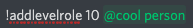

[⬅️ Go back to the homepage](index.html)

# Level Roles system
You can configure the bot to give roles when a member achieve a certain level.
Keep in mind that, ~for now~, the maximum level is 100, but is also really far away.

---
## How to configure a role to be given at a certain level
You just need to do this command:
`!addlevelrole (level number) (mention the role)`

<u>eg:</u> 

Doing this will give the role 'cool person' to every members who achieve the level 10.

**Note:** Every members that have the required level or are above the required level will automatically get the role.
---
## How to remove a configured level role
The following level will remove the role that is normally given at the level given:
`!dellevelrole (level number)`

**Note:** The bot <u>**will not**</u> remove the role to every members that has earned it.