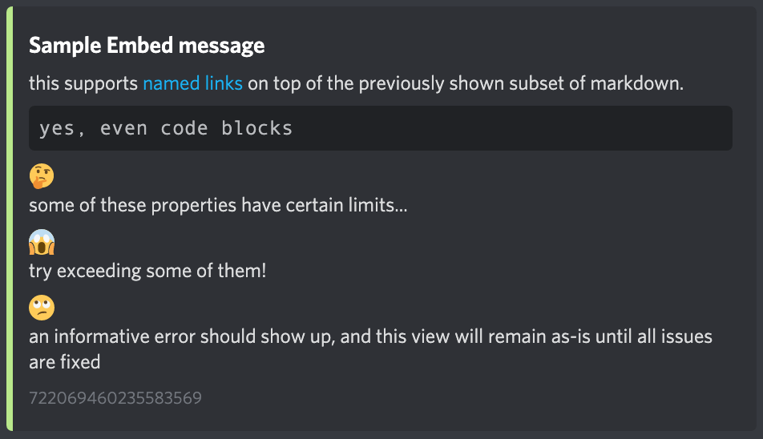

[⬅️ Go back to the homepage](index.html)

# Reaction Roles messages
You can create and configure reaction roles messages with Kwako. Here's how to do.

---
## How to create the Reaction Roles message
0. **Make sure that Kwako's role is above every roles you want people to be able to pick through reaction role messages.**

1. First of all, you will have to create your a Rich Embed message, in JSON format. To do so, you can use this website: [Embed Visualizer](https://leovoel.github.io/embed-visualizer/)
It's really useful to create embeds.
Copy all the JSON part (left part).

2. Now, go into the channel you want the reaction role message to be created, and write:
`!addembed (paste here the JSON code)` *(change the prefix if you edited it)*
If your embed shows up correctly, as next pic, then you're fine to continue.

**⚠️ Important:** Never write text into the 'Footer text' field, it'll get replaced by the UID of the message.

3. To add role, you now have to copy the UID of the message. Fortunately, I wanted to make that easy for everyone, so the UID is showing by itself into the embed.
The UID of the message is shown there:

4. Now, for each role, do this command:
`!addrole (message UID) (emote) (mention role)`
<u>eg:</u>

5. You're done! Repeat the step 4 for each role.
---
## How to edit an embed already sent
1. Create your new embed through the [Embed Visualizer](https://leovoel.github.io/embed-visualizer/). Copy the JSON code.

2. Copy the UID of the embed you want to edit.

3. Do this command:
`!editembed (message UID) (new JSON)`

4. You're done!
---
## How to remove a role from an embed
1. Copy the UID of the embed in which the role is.

2. Do this command:
`!delrole (message UID) (emote)`

3. You're done!
---
## How to remove a Reaction Role embed
1. Copy the UID of the embed you want to delete.

2. Do this command:
`!delembed (message kid)`

3. You're done!